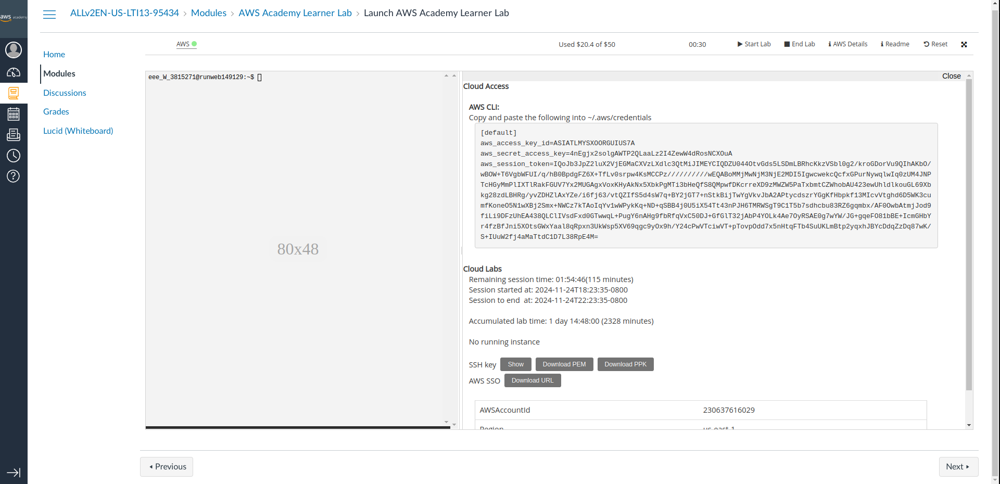
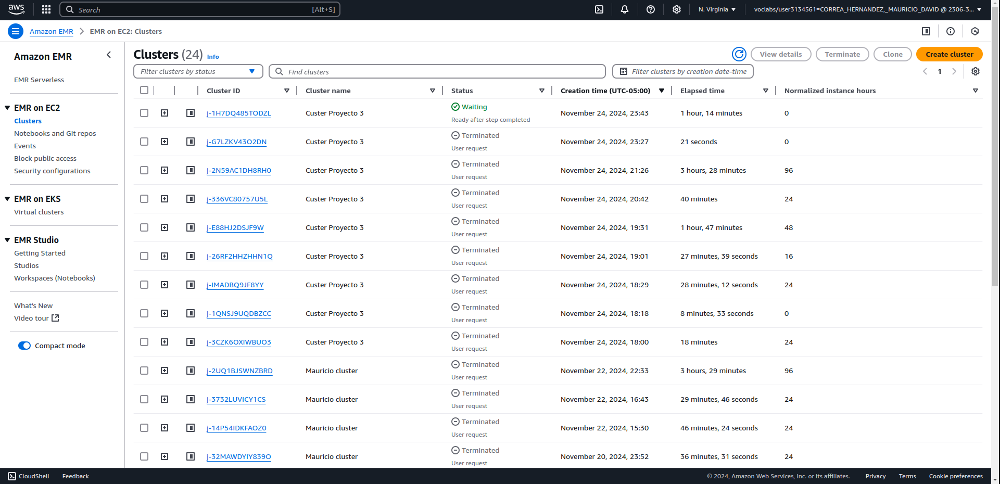
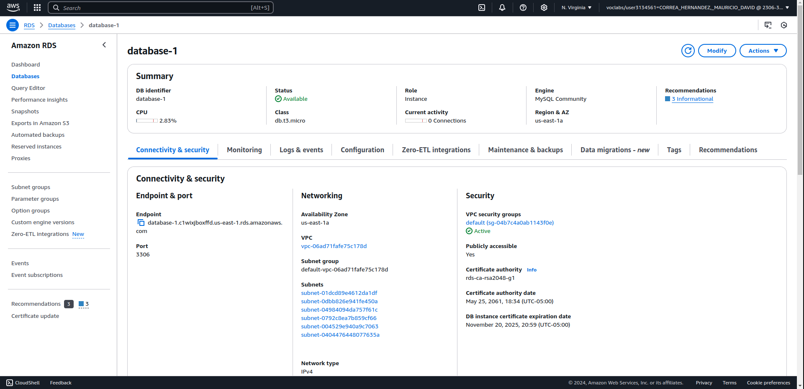
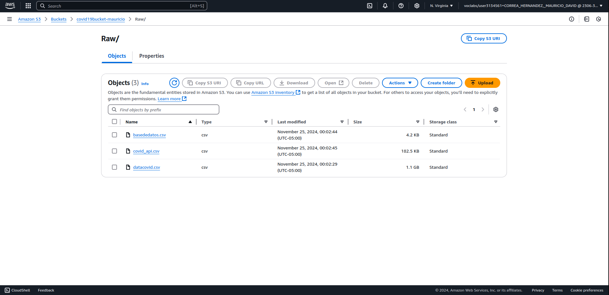
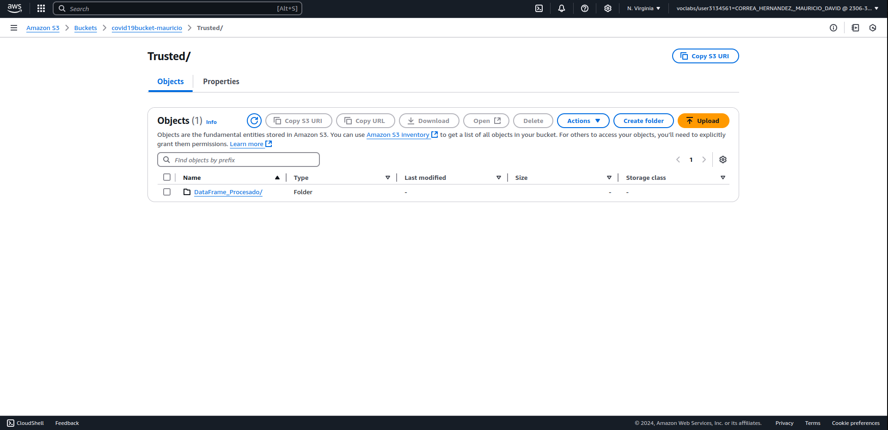
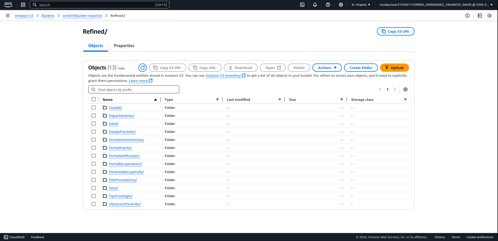
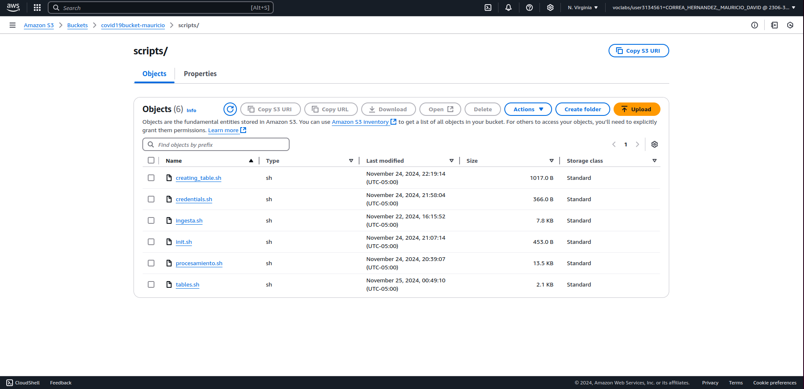
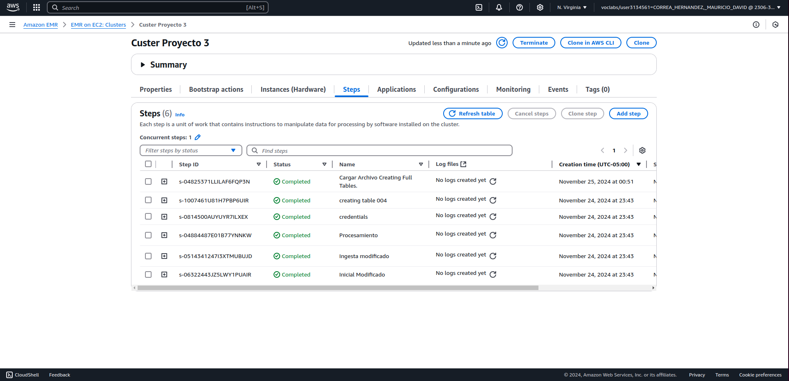
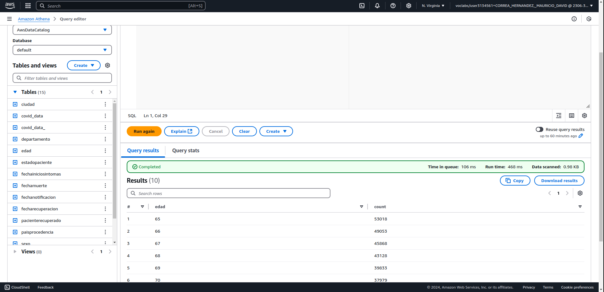
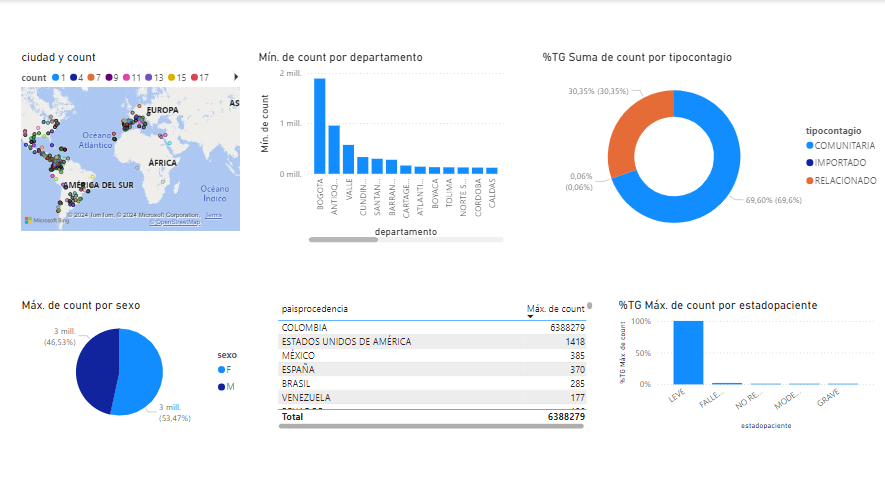

# Info de la materia: ST0263 Tópicos en Telemática
#
# Estudiante(s): 
- ## Mauricio David Correa Hernández, mdcorreah@eafit.edu.co.
- ## David Grisales Posada, dgrisalesp@eafit.edu.co. 
- ## Juan Manuel Garzón, jmgarzonv@eafit.edu.co.
#
# Profesor: 
- ## Edwin Nelson Montoya Múnera, emontoya@eafit.edu.co.
#

# Project 3 - Arquitectura Batch para Big Data.

## 1. Breve descripción de la actividad

En esta ocasión se realizó un trabajo de ingeniería de datos con la información del COVID-19 provista por el ministerio de Colombia. Para eso usamos un clúster EMR con una serie de steps en el cual ejecuta comandos de consola .sh. En los cuales los datos son limpiados, procesados y guardados en diferentes carpetas de un bucket S3.

### 1.1. Que aspectos cumplió o desarrolló de la actividad propuesta por el profesor (requerimientos funcionales y no funcionales)

- Se usó la obtención de datos por medio de API, base de datos con RDS MySQL, y por medio de archivo.
- Los datos se cargan en carpetas en el bucket, los datos puros en la zona Raw, los datos procesados en la zona Trusted y los datos limpios y procesados en la zona Refined.
- Se automatizaron los procesos ETL con Spark para limpiar, procesar los datos y guardarlos en el bucket S3.
- Se automatizó un proceso para cargar el csv generado en la zona Trusted a Power BI usando Athena y ODBC.
- Se automatizó la carga de archivos de la zona Refined hacia Athena.
- Se automatizó la carga de datos cada cierto tiempo usando cron.

### 1.2. Que aspectos NO cumplió o desarrolló de la actividad propuesta por el profesor (requerimientos funcionales y no funcionales)

- Todos los requisitos se cumplieron a cabalidad.

## 2. Información general de diseño de alto nivel, arquitectura, patrones, mejores prácticas utilizadas.


**Pasos:**

* Creación clúster usando script creation_cluster
* Implementación step 1 con script init.sh para crear usuario hadoop.
* Implementación step 2 con script ingesta.sh para realizar la ingesta completa. Chuzar base de datos, descargar archivo, petición a API.
* Implementación step 3 con script procesamiento.sh para hacer el procesamiento completo.
* Implementación step 4 con script credentials.sh para subir las credenciales del laboratorio de AWS Academy para acceder a los servicios.
* Implementación step 5 con script creating_table.sh para crear la tabla sobre el covid con la información procesada almacenada en la zona Trusted.
* Implementación step 6 con script tables.sh para crear las tablas almacenadas en la zona Refined.
* Implementación ODBC en Power BI para leer los datos de las tablas en Athena y realizar análisis.

Los steps se explican mejor en [steps.txt](steps.txt)


## 3. Descripción del ambiente de desarrollo y técnico: lenguaje de programación, librerias, paquetes, etc, con sus numeros de versiones.

### Como se compila y ejecuta.
1. Primero se instala el cliente de AWS.

2. Segundo se configuran las credenciales de AWS con los comandos de consola:

    ```bash
    nano ~/.aws/credentials

    [default]
    aws_access_key_id=ASIA...
    aws_secret_access_key=4nEg...
    aws_session_token=IQoJ...
    ```

3. Luego se corre el comando de consola para crear el clúster `./creation_cluster.sh.`

4. Después de eso los steps (25 a 30 minutos de espera) y demás archivos se corren automáticamente.

5. Quedaría configurar el ODBC con los parámetros de arriba, la base de datos (default), y el workgroup (primary).

6. Luego se crea un archivo en Power BI y se selecciona la opción “Get data”, se selecciona ODBC y se añaden las tablas deseadas.

### Detalles del desarrollo.

Se usó un clúster EMR de Amazon AWS.

El computador que ejecute el código debe tener configuradas las credenciales de AWS usando aws configure …

### Detalles técnicos
Como motor de base de datos SQL se usó RDS de AWS.
Se almacenaron los datos en S3.
Se usó Athena con ODBC para conectar con Power BI.

### Descripción y como se configura los parámetros del proyecto (ej: ip, puertos, conexión a bases de datos, variables de ambiente, parámetros, etc)

Agregar los archivos .sh en el nombre del bucket dado en los steps.

### Opcionalmente - si quiere mostrar resultados o pantallazos 


#### Imágenes.


Aquí tienes los títulos sugeridos para cada imagen:  

1. **Configuración de Credenciales en AWS**


2. **Gestión de Clústeres en Amazon EMR**  


3. **Base de Datos en AWS RDS**  


4. **Estructura de la Zona Raw en S3**  


5. **Estructura de la Zona Trusted en S3**  


6. **Estructura de la Zona Refined en S3**  


7. **Estructura de la Zona Scripts en S3**  


8. **Ejecución Exitosa de Steps en Amazon EMR**  


9. **Visualización de Tablas en Amazon Athena**  


10. **Panel de Control en Herramientas de Power BI**  



## 4. Descripción del ambiente de EJECUCIÓN (en producción) lenguaje de programación, librerias, paquetes, etc, con sus numeros de versiones.
Se usó PySpark.
Se usó el módulo de AWS provisto por Windows para la conexión a Amazon CLI.
### Como se lanza el servidor.

- `chmod +x create_cluster.sh`
- `./create_cluster.sh`

### Una mini guia de como un usuario utilizaría el software o la aplicación
Para comenzar debería lanzar el servidor, o en este caso, mejor dicho clúster.
Instalar el driver ODBC.
Configurar un DSN, sea agregado o existente, en la parte de Schema escribir “default”, en la parte de “workgroup” escribir “primary”, en la parte de S3 output escribir “s3://datasets-mauricio/wcout10/”.
Configurar los Authentications settings con las credenciales de AWS, provistas en AWS details.

## Referencias:
- chatgpt.com
- gemini.google.com
- https://www.youtube.com/watch?v=NNSHu0rkew8&t=1s
- https://youtu.be/8bOgOvz6Tcg?si=rmLduBLZkX4Ut3Kr
- https://docs.aws.amazon.com/athena/latest/ug/connect-with-odbc-and-power-bi.html
- https://interactivavirtual.eafit.edu.co/d2l/le/content/169824/viewContent/966218/View

## Video sustentación.

[Video sustentación de Proyecto 3.](https://eafit-my.sharepoint.com/:v:/g/personal/mdcorreah_eafit_edu_co/EWpnru0MtfBNs5wV-viHtlQBFRjZhVbZK6ANJ3PRyM0W0g?e=tgDiIf)